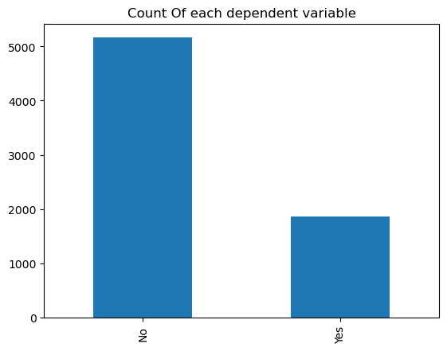
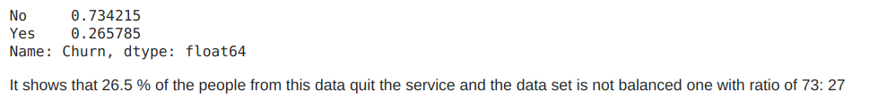
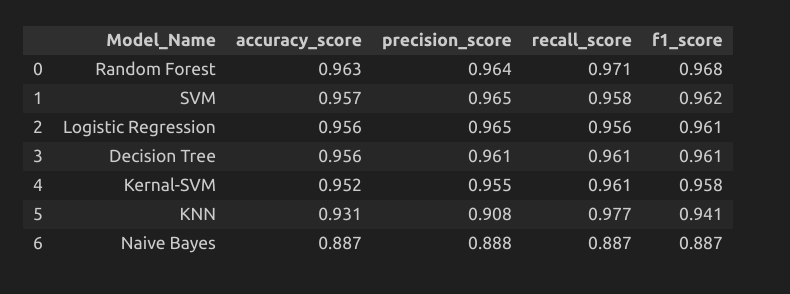

<h1 align="center"> Telecom Churn Prediction</h1>

 

 

<h2> :floppy_disk: Table of Content</h2>

 
  * [Introduction](#Introduction)
  * [Problem Statement](#Problem-Statement)
  * [Objectives](#Objectives)
  * [Data Summary](#Data-Summary)
  * [Steps Involved](#Steps-Involved)
  * [Pre-processing](#Pre-processing)
  * [Algorithms used](#Algorithms-used)
  * [Conclusion](#Conclusion)

<h2> 📄 Introduction</h2>

Customer churn prediction is the process of identifying which customers are likely to leave a service or cancel a subscription based on their usage of the service. It is crucial for many businesses because acquiring new clients is often more expensive than retaining existing ones. To predict churn effectively, companies need to synthesize and utilize key indicators defined by their team to signal when a customer has a probability of churning so that their company can take action.

<h2> ❓ Problem Statement</h2>

In This problem, we trying to solve churning in the telecom industry. Telecom companies face an average annual churn rate of 10-15%, which is significantly high due to the cost of acquiring new customers. To retain highly profitable customers, we use machine learning models to predict churn on an individual customer  basis and take countermeasures such as discounts, special offers, or other gratifications to keep the customers.

<h2> 🎯 Objectives: </h2>

1. Building a predictive model to find and retain customers at the highest risk of churn

2. Gathering information regarding the factors that affect this prediction the most.

<h2> :book: Data Summary </h2>

The data contained 7043 user details who used the service and some of them quit the service due to some issues.

The dataset contains the following information:

* **customerID**
* **gender** - Male/Female
* **SeniorCitizen** - Is Senior Citizen Or Not
* **Partner** - Have partner or Not
* **Dependents** - Have Dependents or Not
* **tenure** - Tenure in months
* **PhoneService** - Have phone service or not
* **MultipleLines** - Do they have multiple lines or no phone at all
* **InternetService** - Internet service type like optic fiber..etc
* **OnlineSecurity** - Have online Security or Not
* **OnlineBackup** - Have an online backup or not
* **DeviceProtection** - Have device protection or not
* **TechSupport** - Do they get support from the company side
* **StreamingTV** - Use Streaming Tv
* 	**StreamingMovies** - Do they watch movies online
* 	**Contract** - package type - Monthly/yearly
* 	**PaperlessBilling** - Online or offline payment
* 	**PaymentMethod** - What kind of payment service they use
* 	**MonthlyCharges** - Subscribed monthly package amount
* 	**TotalCharges** - Total Amount spent by customer till this date
* 	**Churn** - Customer churned or Not (Target variable)

<h2> 📑 Steps involved </h2>

1. Exploring the data: Analyzing the features and target variable, checking for null values and duplicates, plotting the distribution of target variable, etc.

2. Treating numerical and categorical features separately, Encoding, etc.

3. Train test split, Transformation, Scaling, etc.

4. Develop different models and evaluate them.

<h2>🛠️ Pre-processing </h2>

In this project, the dependent variable is ‘User Churned Or Not’, the prediction of which gives us the customers are likely to leave a service or cancel a subscription

We can observe that the dataset is unbalanced. So SMOTENN is used for sampling

<h2>Getting Started</h2>

1.[RawData](https://github.com/Muhliscm/dsProjects/blob/main/telecome_churn_prediction/Model_building.ipynb)  
2.[Exploratory Data Analysis scripts](https://github.com/Muhliscm/dsProjects/blob/main/telecome_churn_prediction/credit_churn_EDA.ipynb) 
3.[Machine learning model building scripts](https://github.com/Muhliscm/dsProjects/blob/main/telecome_churn_prediction/01_Model_building.ipynb) 

<h2>💻 Algorithms used</h2>

* Logistic Regression

* Kernal-SVM

* SVM
  
* Random Forest
  
* KNN

* Decision Tree

* Naive Bayes	

<h3> Model Comparison </h3>

All the models are evaluated on the basis of the following evaluation metrics.

<h3> Best Hyper-parameters </h3>

* Random forest classifier:

 - 'max_depth': 6, 
 - 'max_features': None
 - 'max_leaf_nodes': 9
 - 'n_estimators': 150
  

<h2>:bulb: Conclusion</h2>

This project focuses on predicting  customers are likely to leave a service or cancel a subscription

* In eda we found that Independent people have more chance to churn. Especially single women and customers who
don't get enough support also have a high chance to churn
 

* Among all these models Random forest gives us a accuracy score of 91%

* As a result of this project, telecom companies can better predict the churning customers and focus on methodologies to sustain them.
 

<!-- CREDITS -->
<h2 id="credits"> :scroll: Credits</h2>

MUHLIS CM | Data Scientist | Machine Learning Engineer 

 <i> Contact me for Data Science Project Collaborations</i>

